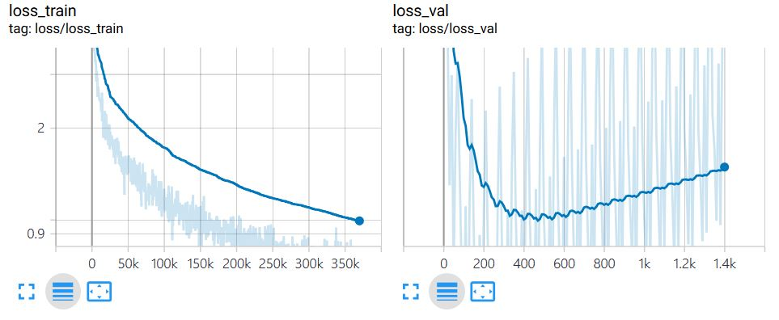

# Transformer
Re-implementation of [Attention Is All You Need](https://arxiv.org/abs/1706.03762) (NIPS 2017)

## Requirements
- python=3.6.0
- pytorch=0.4.1
- sencencepiece=0.1.82
- tensorboardX

## Download datasets
Use IWSLT17 fr-en. The following script downloads datasets and preprocess them.
```
$ download.sh
```

## Sentence Piece Model
Use [SentencePiece](https://github.com/google/sentencepiece) tokenizer for subword-level segmentation in sentences.
```
$ python tokenizer.py --vocab_size 16000
```

## Train model
```
$ MODEL_NAME="model"
$ python main.py --mode train \
                 --datapath './datasets/iwslt17.fr.en'\
                 --langpair 'fr-en'\
                 --epoch 100\
                 --learning_rate 0.0001\
                 --max_seq_len 50\
                 --model_name ${MODEL_NAME}
```

Plot train_loss and val_loss via TensorboardX.


## Evaluate
Use [SacreBLEU](https://github.com/mjpost/sacreBLEU) to evaluate the model based on BLEU score.
```
MODEL_NAME="model"
INPUT_NAME="./iwslt17-fr-en.in"
OUTPUT_NAME="./iwslt17-fr-en.out"
sacrebleu -t iwslt17 -l fr-en --echo src > ${INPUT_NAME}
python main.py --mode test \
    --model_name ${MODEL_NAME} \
    --eval_input ${INPUT_NAME} \
    --eval_output ${OUTPUT_NAME}
cat ${OUTPUT_NAME} | sacrebleu -t iwslt17 -l fr-en
```

| checkout                                 | dataset       | decoding | BLEU |
|------------------------------------------|---------------|----------|------|
| 135bdabaabae068eb1319094ac4817ea4f72c934 | iwslt17 fr-en | greedy   | 30.7 |
